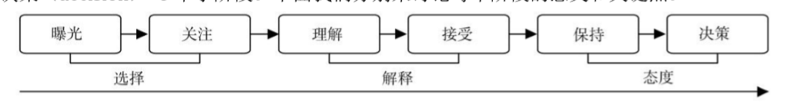
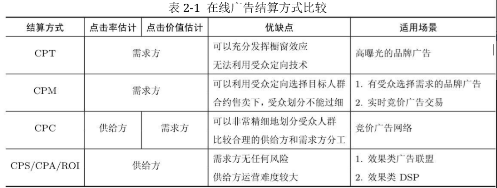
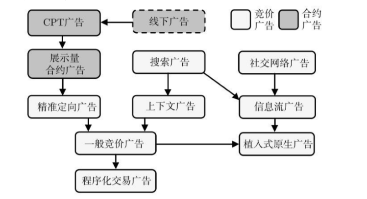
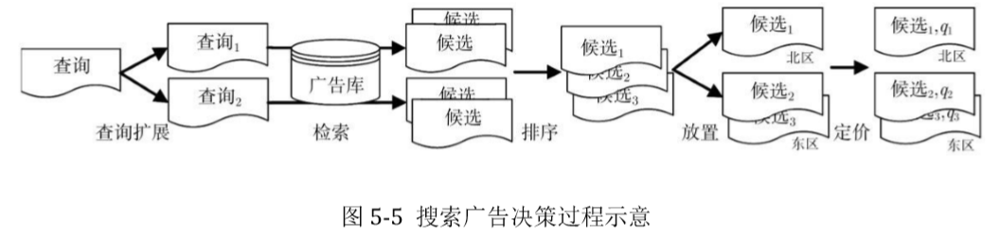

# 综述
广告的参与方：需求方demand、供给方supply、受众audience  
品牌广告：宣传品牌形象、提升中长期购买率和利润空间  
直接效果广告：马上带来大量购买或者其他转化行为  
**广告产生效果的流程**  

- 曝光exposure：广告物理上展现出来  
- 关注attention：受众从物理上接触到广告到意识上注意它的过程  
- 理解comprehension：用户关注到广告内容到理解广告传达的信息  
- 接受acceptance：受众认可广告传达的信息  
- 保持retention：广告传达的信息给用户留下长久的记忆  
- 决策decision：带来用户的转化行为  

**计算广告的核心问题**：为一系列用户和环境的组合找到最合适的广告投放策略以优化整体广告活动的利润  
CTR（click through rate）：点击率，点击产生后打开广告主的落地页  
CVR（conversion rate）：进一步完成下单等  
CPM/eCPM/RPM  
**广告的计费模式**
- CPM：千次展示，mille  
- CPC：按点击结算
- CPS/CPA/ROI：sale/action
- CPT：time

# 在线广告产品

- 合约广告：CPT或CPM，后续效果不宜直接衡量的品牌广告为主  
- 竞价广告：搜索广告是其重要形式，对搜索关键词竞价
- 程序化交易广告：实时竞价
- 原生广告  

# 合约广告
CPT->CPM的转化  
广告位合约，广告排期系统  
**受众定向**：  
- 地域定向
- 人口属性定向
- 频道定向
- 上下文定向（根据网页内容定向）
- 行为定向（用户历史行为）
- 精确位置定向
- 重定向（对广告主过去一段时间的访客投放广告已提升效果）
- 新客推荐（根据种子访客信息，结合平台丰富的数据，为广告主找到行为上相似的客户）
- 团购

**展示量合约，CPM**：
约定某种受众条件下的展示量，担保式投送
- 流量预测
- 流量塑性：导流
- 在线分配，流量分配问题

# 搜索广告、竞价广告
- 变现能力高
- 有受众定向标签，即搜索查询  
**搜索广告决策过程**

定价策略
- 广义第二高价GSP
- VCG
- 市场保留价MRP

# 程序化交易广告
